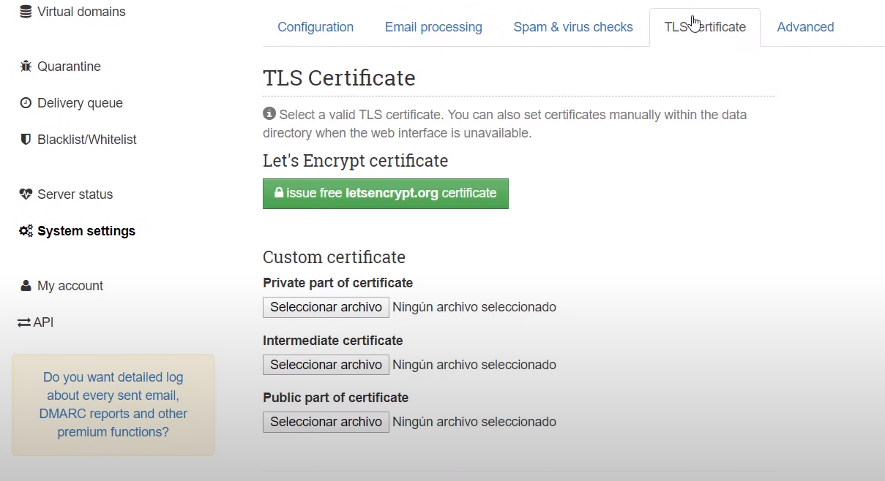
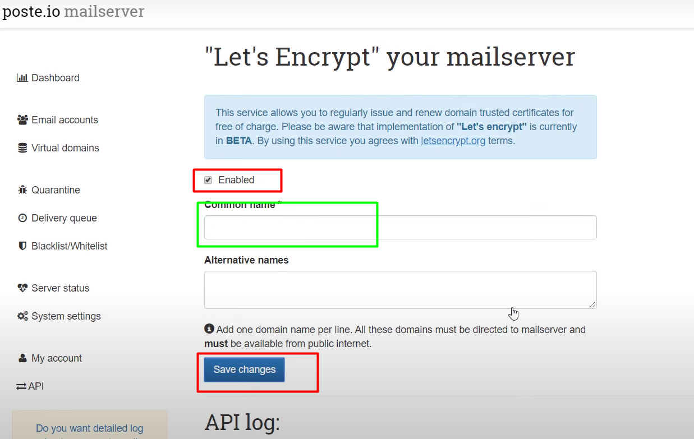
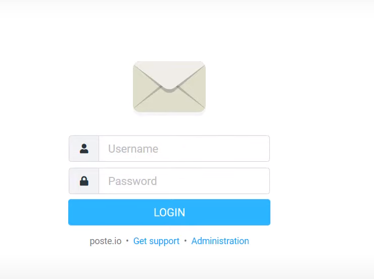

# Mail Server 
Para la creacion de un servidor de correos(mail server), se  utilizara docker y digital ocean.
1. Primero crearemos un droplet en digital ocean de     distribucion ubuntu por ejemplo Ubuntu 20.04 y configurarlo como la cantidad de ram y agregar el ssh,etc. Se da por concluido la creacion del droplet.
2. Ingresamos al servidor que podria ser por la consola que nos brinda digital ocean o putty o en mi caso el git bash.Para el caso del git bash escribiremos el siguiente comando "ssh root@0.0.0.0"  el 0.0.0.0 es la ip del servidor.
3. Dentro del servidor debemos instalar docker y docker composer,para ello se le estara dejando links para la instalaccion de docker y docker compose.
   * Instalacion docker:https://www.digitalocean.com/community/tutorials/how-to-install-and-use-docker-on-ubuntu-20-04-es
   * Instalacion docker compose:https://www.digitalocean.com/community/tutorials/how-to-install-and-use-docker-compose-on-ubuntu-20-04-es
4. Hay que tener un conocimiento basico del uso de docker,en este repositorio se observa un archivo llamado "docker-compose.yaml", creamos este archivo con todo la configuracion en el servidor ubuntu en la ruta principal.
5. Luego usamos docker compose para ejecutarlo y listo ,si no se tiene conocimiento previo se les deja este link https://www.digitalocean.com/community/tutorials/how-to-install-and-use-docker-compose-on-ubuntu-20-04-es en la parte 3 se especifica como ejecutar docker compose,para este caso seria con este comando **docker-compose -f docker-compose.yaml up -d** pero se puede leer mas a detalle en el link.
6. En el digital ocean no olvidar ponerle un subodminio por ejemplo si nuesta pagina www.trejemplo.com , el subdominio podria ser www.email.trejemplo.com ,luego los correos serian algo asi user@trejemplo.com 
7. En el navegador veran que primero les carga un tipo formulario donde les pide un nombre del mailserver ,escribimos el dominio por ejemplo trejemplo.com, luego donde dice administrador creamos un correo administrativo por ejemplo admin@trejemplo.com y agregamos un password ,podemos darle en generar o poner el de nuestro agrado ,se recomienda mejor que sea generado para la seguridad 
8. En el mail Server nos dirigimos a  system settings.
9. Luego a TLSCertificate y presionamos en issue free
10. Marcamos enabled ,en el recuadro verde no olvidar poner el nombre subdominio email.trejemplo.com ,deberia aparecerles ,en el caso que no estubiera ,Escribimos y  presionamos en submit 
11. Finalmente ya tendriamos nuestro servidor de correos, cada vez que entren se tendran que loguear con su correo administrativo y contraseña 